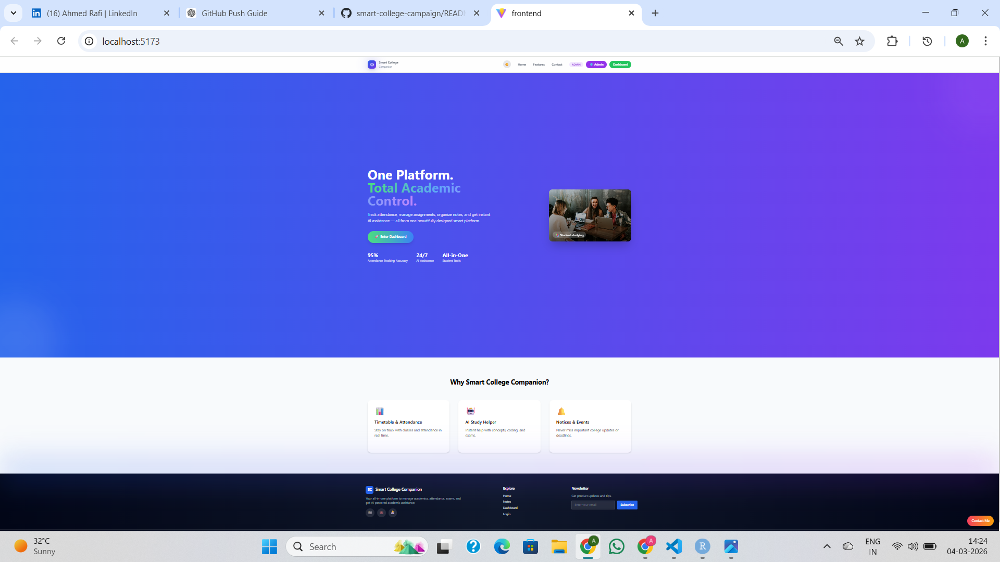
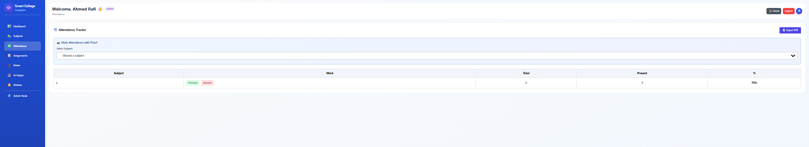
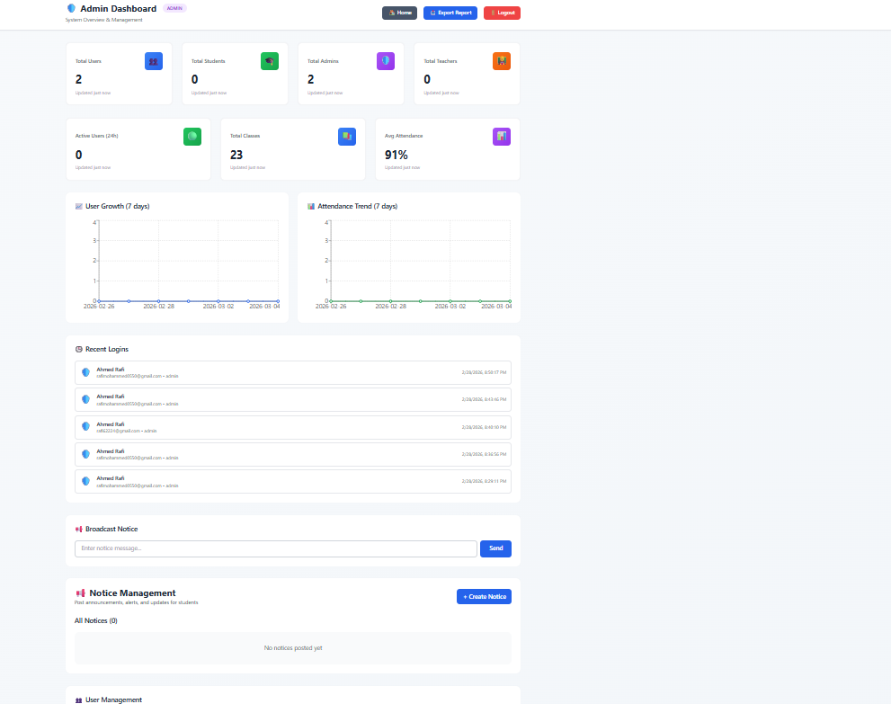
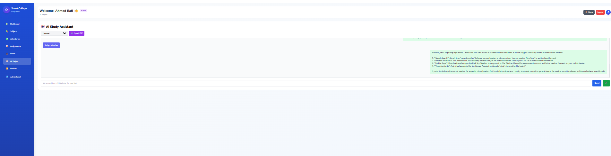

# 🎓 Smart College Companion

A **Full Stack AI-Powered College Management System** designed to help students, teachers, and administrators manage academic activities efficiently.

This platform provides **attendance tracking, assignments, notices, AI study tools, dashboards, and role-based access control** to simplify academic workflows.

---

## 🚀 Live Overview

Smart College Companion is built to centralize common academic operations in one platform.
It helps institutions manage:

* Student activities
* Attendance tracking
* Assignments
* Notices
* AI powered study assistance
* Admin analytics and reports

The system supports **three user roles**:

* 👨‍🎓 Student
* 👩‍🏫 Teacher
* 🛠 Admin

---

# 🧩 Features

## 👨‍🎓 Student Features

* View assignments
* Track attendance
* Receive notices
* Access study notes
* AI Study Planner
* AI helper for academic queries
* Activity feed
* Dashboard statistics

---

## 👩‍🏫 Teacher Features

* Manage subjects
* Upload assignments
* Post notices
* Monitor attendance
* Track student activity
* Generate class codes

---

## 🛠 Admin Features

* Manage users
* View analytics dashboard
* Manage newsletters
* System reports
* Control permissions

---

## 🤖 AI Powered Tools

* AI Study Planner
* AI Chat Assistant
* Notes summarization
* Academic help suggestions

AI integration helps students organize study schedules and understand difficult concepts.

---

# 🏗 System Architecture

Frontend and backend follow a **modern full-stack architecture**.

```
Frontend (React + Vite)
        ↓
REST API (Express.js)
        ↓
Backend Services
        ↓
MongoDB Database
```

The system uses **REST APIs** for communication between frontend and backend.

---

# 🛠 Tech Stack

## Frontend

* React
* Vite
* Tailwind CSS
* Axios
* React Router

## Backend

* Node.js
* Express.js
* MongoDB
* Mongoose
* JWT Authentication

## AI Integration

* OpenAI / Groq API
* AI Chat
* Study planner tools

---

# 📁 Project Structure

```
smart-college-companion

├── frontend
│
│   ├── src
│   │   ├── components
│   │   ├── pages
│   │   ├── hooks
│   │   ├── services
│   │   └── assets
│   │
│   ├── index.html
│   └── vite.config.js
│
├── backend
│
│   ├── config
│   ├── controllers
│   ├── middleware
│   ├── models
│   ├── routes
│   ├── utils
│   └── server.js
│
└── documentation files
```

---

# ⚙️ Installation Guide

## 1️⃣ Clone Repository

```bash
git clone https://github.com/yourusername/smart-college-companion.git
```

---

## 2️⃣ Install Backend Dependencies

```
cd backend
npm install
```

---

## 3️⃣ Install Frontend Dependencies

```
cd frontend
npm install
```

---

## 4️⃣ Setup Environment Variables

Create `.env` file inside **backend**

Example:

```
PORT=5000
MONGO_URI=your_mongodb_connection
JWT_SECRET=your_secret_key
GROQ_API_KEY=your_api_key
```

---

## 5️⃣ Run Backend Server

```
cd backend
npm run dev
```

Server runs on:

```
http://localhost:5000
```

---

## 6️⃣ Run Frontend

```
cd frontend
npm run dev
```

Frontend runs on:

```
http://localhost:5173
```

---

# 🔐 Authentication & Security

The platform implements:

* JWT authentication
* Role based access control
* Secure password hashing
* API protection middleware

---

# 📊 Dashboard Modules

The dashboard provides:

* Attendance analytics
* Assignment tracking
* Activity feed
* Subject management
* Notice system
* Reports & statistics

---

# 📷 Screenshots

Add screenshots here later.

Example:

```
/screenshots/dashboard.png
/screenshots/attendance.png
/screenshots/admin-panel.png
```

---

# 🌟 Future Improvements

Planned enhancements:

* Mobile responsive UI improvements
* Push notifications
* Real time chat
* Video lecture integration
* AI powered performance prediction

---

# 👨‍💻 Author

Ahmed Rafi

Full Stack Developer
Yenepoya School of Engineering

---

# 📜 License

This project is licensed under the MIT License.\
## Live Demo

Frontend:
https://smart-college-campaign.vercel.app

Backend API:
https://smart-college-campaign.onrender.com

## 📷 Screenshots

### Student Dashboard


### Attendance System


### Admin Panel


### AI Study Planner

---

# ⭐ Support

If you like this project, consider giving it a **star on GitHub**.
